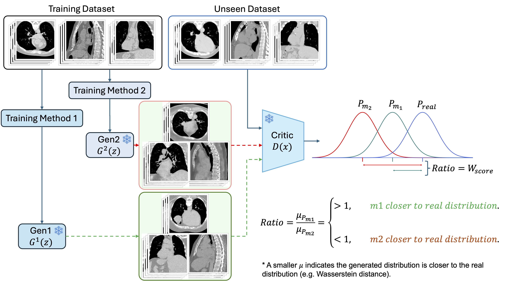

# w-critic

`w-critic` is a WGAN-GP-based shared critic for pairwise comparison between two image generators. For each generator pair, one critic is trained with real samples and a mixed fake set built from those two generators. The trained critic is then used to evaluate which generator is closer to the real data distribution under the same reference.



## Background

When comparing two generators, the main question is which one produces samples that are closer to the real data distribution. A critic trained to separate real images from generated images can provide a useful evaluation signal for this purpose.

In `w-critic`, the two generators are evaluated with the same critic rather than with separate critics. The critic is trained on real samples and on a pooled fake set that contains samples from both generators. This gives a shared reference for the pairwise comparison.

After training, the same critic is applied separately to withheld samples from generator A and generator B. Because both generators are measured against the same real set and the same trained critic, their distance scores can be compared directly within the pair. The generator with the smaller real-fake distance is interpreted as being closer to the real data distribution under this evaluation setting.

## Overview

The method uses one shared critic for one generator pair:

- real samples from the target dataset
- fake samples from generator A
- fake samples from generator B

The fake samples are combined into a single pooled fake distribution:

`fake_pool = fake_A ∪ fake_B`

The critic is trained to distinguish:

- `real`
- `fake_pool`

## Requirements

- Python 3.9+
- PyTorch >= 2.1.0
- nibabel >= 5.0.0
- numpy >= 1.24.0

Install dependencies:

```bash
pip install -r requirements.txt
```

A CUDA-capable GPU is recommended. The script falls back to CPU automatically when CUDA is not available.

## Data Format

`w-critic` is domain-agnostic and works with any image type — medical volumes (MRI, CT), 2-D medical slices, and natural images alike.

Organize images into one directory per split:

```
/data/
  real/          ← target distribution
    img_001.nii.gz   # or .nii for medical volumes
    img_002.png      # or .png / .jpg for natural images
    ...
  gen_A/         ← generator A samples
    ...
  gen_B/         ← generator B samples
    ...
```

**3-D volumes** (`--ndim 3`): NIfTI (`.nii` / `.nii.gz`) with shape `(H, W, D)` or `(H, W, D, T)` — the first frame is used for 4-D inputs.

**2-D slices / natural images** (`--ndim 2`): NIfTI slices with shape `(H, W)` or `(H, W, D)` (middle axial slice is extracted), or standard image files (`.png`, `.jpg`, etc.) saved as single-channel or multi-channel 2-D arrays.

Each image is resampled to `isize × isize [× isize]` and normalized to `[-1, 1]` before being passed to the critic. A data-range check is printed at startup to catch common issues (flat images, out-of-range normalization).

## Pairwise Evaluation Protocol

For each pair of generators:

1. Collect real samples from the target data distribution.
2. Collect fake samples from generator A and generator B.
3. Mix the two fake sets into one pooled fake distribution.
4. Train one critic on `real` versus `fake_pool`.
5. Keep separate withheld evaluation samples for generator A and generator B.
6. Apply the same trained critic to each withheld fake set against the real set.
7. Compare the resulting real-fake distances.

## Quick Start

1. Set your data paths and image dimensionality in `run.sh`:

   | Variable | What to set |
   |---|---|
   | `REAL_DIR` | Path to real images |
   | `FAKE_DIRS` | Space-separated paths to each generator's folder |
   | `NDIM` | `3` for volumes, `2` for slices |
   | `ISIZE` | Spatial size images are resampled to (e.g. `128`) |

2. Run:

   ```bash
   bash run.sh
   ```

That's it. Results are printed to the terminal and the best checkpoint is saved under `./runs/`.

## Full CLI Reference

| Argument | Default | Description |
|---|---|---|
| `--real_dir` | *(required)* | Directory of real `.nii`/`.nii.gz` images |
| `--fake_dirs` | *(required)* | One or more generator directories (space-separated) |
| `--arch` | `cnn` | Critic architecture (`cnn`) |
| `--isize` | `64` | Isotropic spatial size to resample images to |
| `--ndim` | `3` | Spatial dimensionality: `2` for slices, `3` for volumes |
| `--in_channels` | `1` | Number of image channels |
| `--epochs` | `200` | Maximum training epochs |
| `--batch_size` | `4` | Batch size |
| `--patience` | `10` | Patience window for early stopping |
| `--real_train_ratio` | `0.6` | Fraction of real data for training (rest is held out for evaluation) |
| `--fake_train_ratio` | `0.6` | Fraction of fake data for training |
| `--lr` | arch default | Learning rate (overrides per-arch default) |
| `--gp_lambda` | arch default | Gradient-penalty coefficient (overrides per-arch default) |
| `--ndf` | auto-scaled | CNN base channel width (auto-derived from `isize` when omitted) |
| `--out_dir` | `./checkpoints` | Directory for saving the best checkpoint |
| `--device` | `cuda` / `cpu` | Compute device (auto-detected) |
| `--num_workers` | `4` | DataLoader worker processes |
| `--seed` | *(none)* | Random seed for reproducibility |

Architecture-specific overrides (rarely needed; auto-scaled from `isize` by default):

| Argument | Applies to |
|---|---|
| `--ndf` | CNN channel width |
| `--patch_size` | Transformer patch size |
| `--d_model` | Transformer / Hybrid model dimension |
| `--n_heads` | Transformer / Hybrid attention heads |
| `--n_layers` | Transformer / Hybrid encoder layers |

## Output

Each run saves one checkpoint:

```
<out_dir>/best.pt    ← critic weights at the epoch with the highest valid W-distance
```

At the end of training, per-generator evaluation scores are printed:

```
Final scores  (epoch 14):
  Model                                     W-distance     Ratio
  ----------------------------------------  ------------  --------
  gen_A                                          0.3821     1.000  ← closer to real
  gen_B                                          0.5104     1.336
```

## Score Interpretation

The output of `w-critic` is a critic-based distance score for each generator in the pair.

- a **smaller** distance indicates that the generator is **closer** to the real data distribution under the shared critic
- a **larger** distance indicates that the generator is **farther** from the real data distribution under the shared critic

Because both generators are evaluated by the same critic, the two scores can be compared directly within the pair. The **Ratio** column normalizes both scores by the best (lowest) W-distance, making the relative gap easy to read.

A **negative** W-distance means the critic has not converged — the Lipschitz constraint is violated and the score is unreliable. See [Troubleshooting](#troubleshooting) below.

## Convergence Monitoring

Every epoch prints three diagnostics:

```
[  14/20] trainW=0.3821  GN=1.024  GP=0.041  (12.3s) *
```

| Field | Meaning | Healthy range |
|---|---|---|
| `trainW` | Mean Wasserstein distance for this epoch | Increasing then stable |
| `GN` | Mean gradient norm of the critic at interpolated points | `0.90 – 1.10` |
| `GP` | Mean gradient penalty loss | Near zero once converged |
| `*` | Checkpoint saved (new best `trainW` with valid `GN`) | — |

Early stopping triggers when all three criteria hold for `patience` consecutive epochs:
- W-distance coefficient of variation < 5 %
- GN stays within `[0.90, 1.10]` for every epoch in the window
- Mean GP < 5 % of `gp_lambda`

Training also stops early if GN exceeds `2.0` for `patience` consecutive epochs (GradNorm divergence).

## Architecture

### CNN Critic (default)

A strided-convolution pyramid that halves spatial resolution at each block until the spatial size reaches 8, then collapses to a scalar via a full-spatial convolution.

- **No sigmoid** — raw unbounded output required for WGAN-GP
- **3-D**: spectral normalization on every convolution; max channels = `ndf × 4`
- **2-D**: no spectral normalization; max channels = `ndf × 8`
- `ndf` is auto-scaled from `isize`: `ndf = clamp(isize // 2, 32, 128)`

| `isize` | Downsampling blocks | Auto `ndf` |
|---|---|---|
| 64 | 3 | 32 |
| 128 | 4 | 64 |
| 256 | 5 | 128 |

## Troubleshooting

**GN keeps climbing above 1.10**

The Lipschitz constraint is not being enforced strongly enough. Try:
- Increase `GP_LAMBDA` (e.g. `20`, `30`)
- Decrease `LR` (e.g. `1e-5`)

**No checkpoint saved — GN never entered [0.90, 1.10]**

The critic diverged immediately. Try:
- Larger `GP_LAMBDA`
- Smaller `LR`
- Smaller `NDF` (reduce model capacity)

**Negative W-distance in final scores**

The best checkpoint still has an unreliable critic. Retrain with stronger GP regularization (larger `GP_LAMBDA`) or more epochs.

**Images with large or unusual value ranges**

If the data-range check prints `LARGE raw max` or the normalized output falls outside `[-1, 1]`, pre-process your images to a consistent intensity range before passing them to `w-critic` (e.g. clip CT HU values to a soft-tissue window `[-150, 250]`, or normalize natural images to `[0, 1]`).

**Out-of-memory on 3-D volumes**

Reduce `BATCH_SIZE` to `2` or `1`, or lower `ISIZE` (e.g. from `128` to `64`).
